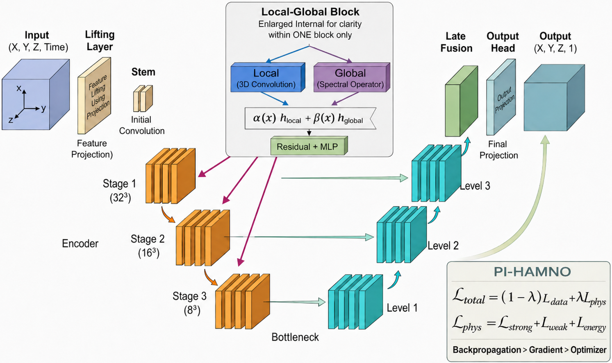

# HAMNO

**HAMNO** is a **Hierarchical Adaptive Multi-scale Neural Operator** for learning long-time solution operators of nonlinear three-dimensional phase-field dynamical systems. The model is designed for non-periodic PDEs with homogeneous Neumann boundary conditions and is evaluated on the Allen--Cahn, Cahn--Hilliard, and Swift--Hohenberg equations.

<p align="center">
  
</p>

<p align="center">
  <b>Schematic overview of HAMNO and its physics-informed extension PI-HAMNO.</b>
</p>

---

## Overview

HAMNO learns the one-step solution operator

$$
\mathcal{G}_{\theta}:
\left(
u^{n-T_{\mathrm{in}}+1},
\ldots,
u^{n-1},
u^{n}
\right)
\longmapsto
u_{\theta}^{n+1}.
$$

Here, a short temporal history of 3D phase fields is used to predict the next state. During evaluation, this learned one-step map is applied autoregressively to reconstruct the full time evolution.

The framework is developed for nonlinear, multi-scale, time-dependent PDEs where accurate long-horizon prediction requires both local feature resolution and global operator interaction.

---

## Main idea of HAMNO

HAMNO combines three key components:

1. **Local convolutional operators**  
   Capture nearby spatial interactions, sharp interfaces, and fine-scale structures.

2. **Global spectral operators**  
   Model long-range dependencies and global solution behavior through Fourier-based operator learning.

3. **Hierarchical encoder--decoder structure**  
   Learns solution features across multiple spatial resolutions using downsampling, upsampling, and skip connections.

The central innovation is an **adaptive local--global gating mechanism**. Instead of combining local and global features with fixed weights, HAMNO learns data-dependent fusion weights at each spatial location:

$$
h_{\mathrm{fused}}(\mathbf{x})
=
\alpha(\mathbf{x})\,h_{\mathrm{local}}(\mathbf{x})
+
\beta(\mathbf{x})\,h_{\mathrm{global}}(\mathbf{x}).
$$

This allows the model to decide how much local or global information is needed depending on the evolving solution field and spatial scale.

---

## HAMNO architecture

HAMNO first lifts the input history and spatial coordinates into a latent feature space:

$$
v_0(\mathbf{x})
=
P\left(
\mathbf{U}_{\mathrm{in}}^n(\mathbf{x}), \mathbf{x}
\right),
$$

where

$$
\mathbf{U}_{\mathrm{in}}^n
=
\left[
u^{n-T_{\mathrm{in}}+1},
\ldots,
u^{n}
\right].
$$

Each HAMNO block applies two complementary operator branches:

$$
h_{\mathrm{local}}
=
\mathcal{K}_{\mathrm{local}}(h),
\qquad
h_{\mathrm{global}}
=
\mathcal{K}_{\mathrm{global}}(h).
$$

The local branch captures nearby spatial patterns, while the global branch captures long-range spectral interactions. The two branches are then adaptively fused using the learned gating mechanism:

$$
h_{\mathrm{fused}}
=
\alpha h_{\mathrm{local}}
+
\beta h_{\mathrm{global}}.
$$

The fused representation is updated through residual connections:

$$
v_{\ell}^{\prime}
=
v_{\ell}
+
\mathcal{M}
\left(
h_{\mathrm{fused}}
\right),
$$

$$
v_{\ell+1}
=
v_{\ell}^{\prime}
+
\Psi_{\ell}
\left(
\mathrm{Norm}
\left(
v_{\ell}^{\prime}
\right)
\right),
$$

where `M` is a channel-mixing operator and `Ψ` is a nonlinear pointwise feature transformation.

The encoder progressively reduces spatial resolution to capture coarse global structures, while the decoder reconstructs fine-scale details using upsampling and skip connections. The final prediction is obtained by

$$
u_{\theta}^{n+1}(\mathbf{x})
=
Q
\left(
v_{\mathrm{final}}(\mathbf{x})
\right).
$$

---

## Difference from related neural operators

HAMNO differs from common neural-operator baselines as follows:

| Model | Main feature | Limitation addressed by HAMNO |
|---|---|---|
| **FNO** | Global Fourier operator | Limited recovery of localized and high-frequency structures |
| **F-FNO** | Factorized spectral operators | Efficient spectral mixing, but limited adaptive multi-scale fusion |
| **DeepONet** | Branch--trunk operator representation | Separates input and coordinate encoding but lacks hierarchical local--global fusion |
| **U-Net** | Local encoder--decoder | Strong local representation but no explicit global spectral operator |
| **U-NO** | U-shaped neural operator | Multi-resolution structure, mainly spectral-driven |
| **U-FNO** | Fourier layers with U-Net components | Uses fixed additive local--global fusion |
| **HAMNO** | Adaptive local--global hierarchical neural operator | Learns when and where to use local, global, and multi-scale information |

In summary, HAMNO combines the strengths of Fourier neural operators, convolutional models, and U-shaped architectures, while replacing fixed feature fusion with adaptive local--global operator coupling.

---

## Physics-informed extension: PI-HAMNO

**PI-HAMNO** extends HAMNO by adding physics-based regularization during training. The total loss is

$$
\mathcal{L}_{\mathrm{total}}
=
(1-\lambda)\mathcal{L}_{\mathrm{data}}
+
\lambda\mathcal{L}_{\mathrm{phys}},
$$

where `λ` controls the balance between data fitting and physics enforcement.

The physics loss combines two complementary PDE constraints:

$$
\mathcal{L}_{\mathrm{phys}}
=
\mathcal{L}_{\mathrm{strong}}
+
\mathcal{L}_{\mathrm{weak}}.
$$

### Strong-form residual

The strong-form residual directly penalizes the PDE defect in physical coordinates:

$$
R_{\mathrm{FD}}
=
\frac{
u_{\theta}^{n+1}
-
u^{n}
}{
\Delta t
}
-
\mathcal{N}
\left(
u_{\theta}^{n+1}
\right).
$$

The corresponding loss is computed by integrating the squared residual over the domain:

$$
\mathcal{L}_{\mathrm{strong}}
\approx
\int_{\Omega}
R_{\mathrm{FD}}^2
\,d\mathbf{x}.
$$

This term improves local PDE consistency and is sensitive to sharp gradients, interfaces, and high-frequency errors.

### Weak-form residual

The weak-form residual enforces the PDE in a variational sense:

$$
\int_{\Omega}
\left(
u_t
-
\mathcal{N}(u)
\right)
v
\,d\Omega
=
0.
$$

In PI-HAMNO, the domain is decomposed into tetrahedral elements, and the weak residual is assembled using finite-element test functions and centroid-based quadrature:

$$
\mathcal{L}_{\mathrm{weak}}
=
\frac{1}{N_e}
\sum_K
\sum_i
\left(
r_i^K
\right)^2.
$$

The strong form controls local differential errors, while the weak form improves global variational consistency, numerical conditioning, and compatibility with homogeneous Neumann boundary conditions.

---

## Supported benchmark problems

The current implementation supports three 3D non-periodic phase-field equations:

- **AC3D**: Allen--Cahn equation
- **CH3D**: Cahn--Hilliard equation
- **SH3D**: Swift--Hohenberg equation

The active problem is selected in `config.py`:

```python
PROBLEM = 'AC3D'   # Options: 'AC3D', 'CH3D', 'SH3D'
MODEL = 'HAMNO3d'
```

---

## Repository structure

```text
HAMNO/
├── config.py              # Main configuration file
├── main.py                # Training and evaluation entry point
├── Trainer.py             # Data loading, training, rollout, and plotting utilities
├── functions.py           # Physics losses and numerical operators
├── networks.py            # Neural-operator architectures
├── requirements.txt       # Required Python packages
├── HAMNO_Architecture/    # Architecture figures
├── Results/               # Result figures and outputs
└── Trained_Models/        # Saved model checkpoints
```

---

## Installation

Clone the repository:

```bash
git clone https://github.com/MBamdad/HAMNO.git
cd HAMNO
```

Install the required Python packages:

```bash
pip install -r requirements.txt
```

If you are using a GPU, make sure that your PyTorch installation matches your CUDA version.

---

## How to run

First, edit `config.py` and select the desired problem and model:

```python
PROBLEM = 'AC3D'
MODEL = 'HAMNO3d'
```

Then run:

```bash
python main.py
```

The code will:

1. Load the selected 3D phase-field dataset.
2. Build the selected neural-operator model.
3. Train the model using the configured loss setting.
4. Evaluate long-horizon autoregressive rollout.
5. Save results and trained checkpoints.

---

## Data path

The dataset path is set in `config.py`:

```python
MAT_DATA_PATH = "path/to/your/data.mat"
```

Each `.mat` file should contain the phase-field trajectories used for training and testing.

---

## Key features

- Hierarchical adaptive multi-scale neural operator
- Local convolutional and global spectral operator coupling
- Data-dependent local--global gating
- Encoder--decoder structure with skip connections
- Long-horizon autoregressive rollout
- Strong-form and weak-form physics-informed training
- Support for non-periodic 3D phase-field dynamics
- Applications to AC, CH, and SH equations

---

## Key achievements

HAMNO and PI-HAMNO are designed to improve:

- Long-time rollout accuracy
- Stability of autoregressive prediction
- Representation of local interfaces and global dynamics
- Physical consistency under non-periodic boundary conditions
- Data efficiency in limited-training-data regimes
- Robustness for multi-scale nonlinear phase-field systems

---

## Citation

If you use this repository, please cite the related HAMNO manuscript:

```bibtex
@article{bamdad2026hamno,
  title={HAMNO: A Hierarchical Adaptive Multi-scale Neural Operator with Physics-Informed Learning for Dynamical Systems},
  author={Bamdad, Mostafa and Eshaghi, Mohammad Sadegh and Rabczuk, Timon},
  journal={Transactions on Mathematical Sciences and Computational Engineering},
  year={2026}
}
```

---

## Contact

For questions, please contact:

**Mostafa Bamdad**  
Bauhaus-Universität Weimar  
mostafa.bamdad@uni-weimar.de
